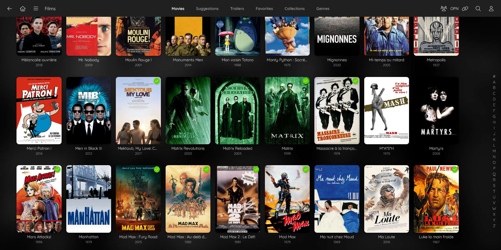
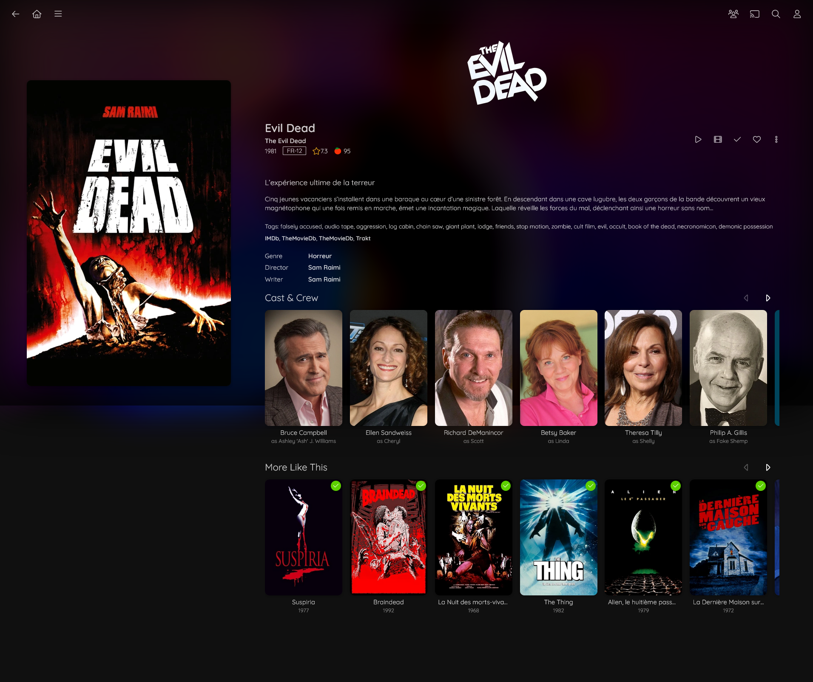
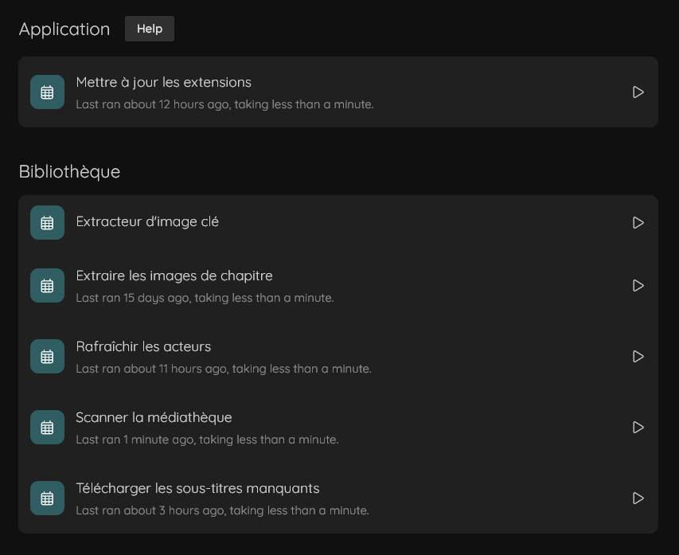
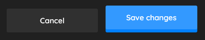
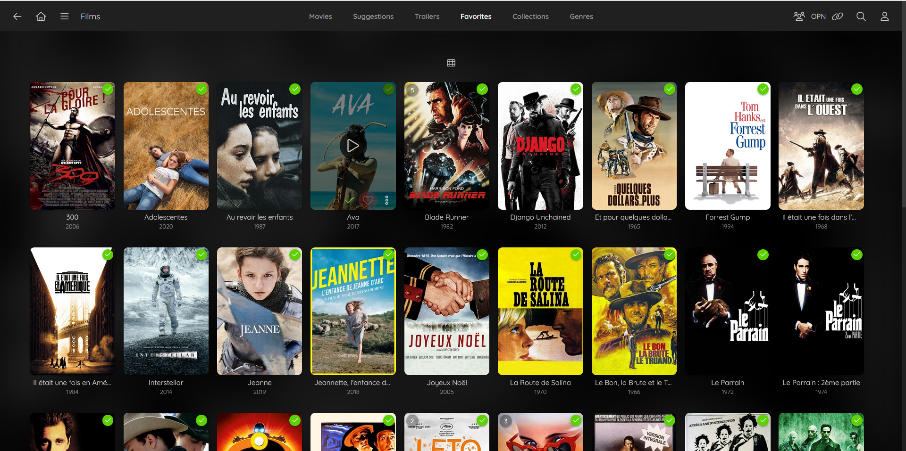
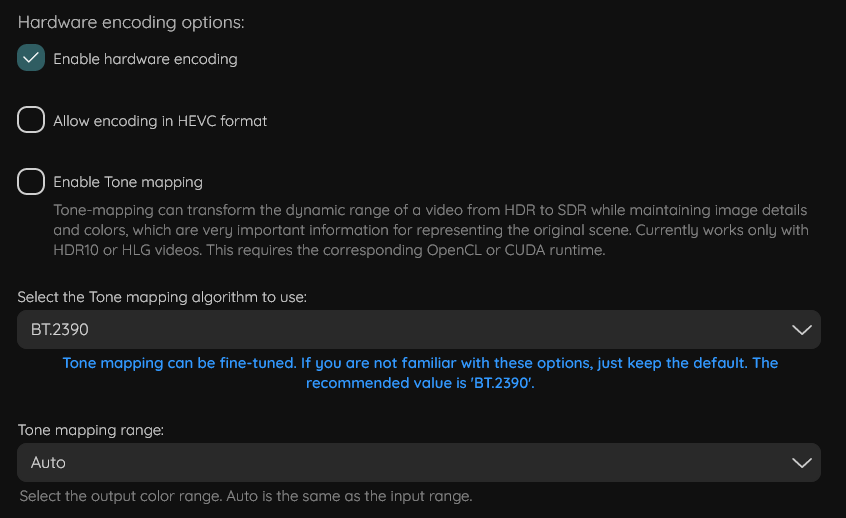

# Jellyfin Meduse

A custom and a personal interpretation CSS theme for Jellyfin.



## How to use?

Load any CSS file you want using jsDelivr directly inside your settings (*Dashboard/General/Custom CSS code*). In the following replace `{filename}` with the CSS file you need.

```css
@import url("https://cdn.jsdelivr.net/gh/Nicryc/jellyfin-meduse@main/{filename}.css");
```

### `animation.css`
Creates an animation for the favorite and watched buttons in some context. Typically on the detail page. To load it:

```css
@import url("https://cdn.jsdelivr.net/gh/Nicryc/jellyfin-meduse@main/animation.css");
```

### `backdrop-blur.css`
Adds a background blur effect when navigating Jellyfin. To load it:

```css
@import url("https://cdn.jsdelivr.net/gh/Nicryc/jellyfin-meduse@main/backdrop-blur.css");
```



### `badge.css`
Changes the design of the badges (used in the dashboard mainly). To load it:

```css
@import url("https://cdn.jsdelivr.net/gh/Nicryc/jellyfin-meduse@main/badge.css");
```



### `button-icon.css`
Changes the appearance of icon-only buttons. It mainly removes the background color on hover. To load it:

```css
@import url("https://cdn.jsdelivr.net/gh/Nicryc/jellyfin-meduse@main/button-icon.css");
```

### `button.css`
Creates a 3D effect on block buttons when hovering them among some other little fixes. To load it:

```css
@import url("https://cdn.jsdelivr.net/gh/Nicryc/jellyfin-meduse@main/button.css");
```



### `card.css`
Changes different elements in the cards (used to present medias) but mainly the border radius. To load it:

```css
@import url("https://cdn.jsdelivr.net/gh/Nicryc/jellyfin-meduse@main/card.css");
```



### `color.css`
Replaces accentuation colors by others. To load it:

```css
@import url("https://cdn.jsdelivr.net/gh/Nicryc/jellyfin-meduse@main/color.css");
```

### `icon-fix.css`
Fixes Font Awesome Light icons related issues. To load it:

```css
@import url("https://cdn.jsdelivr.net/gh/Nicryc/jellyfin-meduse@main/icon-fix.css");
```

### `input.css`
Slightly modifies text input, text area input and select input design. To load it:

```css
@import url("https://cdn.jsdelivr.net/gh/Nicryc/jellyfin-meduse@main/input.css");
```



### `jellyfin-custom-theme.css`
General and verious modifications of Jellyfin. To load it:

```css
@import url("https://cdn.jsdelivr.net/gh/Nicryc/jellyfin-meduse@main/jellyfin-custom-theme.css");
```

### `keywords-position.css` (does not work)
Attempts to move the keywords and metadata providers links in the media detail pages below the poster. To load it:

```css
@import url("https://cdn.jsdelivr.net/gh/Nicryc/jellyfin-meduse@main/keywords-position.css");
```

**Note:** It works badly though.

### `media-player.css`
Styles the media player progression bar. To load it:

```css
@import url("https://cdn.jsdelivr.net/gh/Nicryc/jellyfin-meduse@main/media-player.css");
```

### `tooltip.css`
Adds a tooltip for icon-only buttons in some context (in the header, on detail page etc.). To load it:

```css
@import url("https://cdn.jsdelivr.net/gh/Nicryc/jellyfin-meduse@main/tooltip.css");
```

## Recommendation
I recommend to load the files in this order:
1. `jellyfin-custom-theme` (mandatory since it imports other CSS files)
2. `icon-fix`
3. `input`
4. `button`
5. `card`
6. `media-player`
7. `tooltip`
8. `button-icon`
9. `color`
10. `badge`
11. `backdrop-blur`
12. `animation`
13. `keywords-position`

## Note
This theme doesn't intend to be cross-browser compatible and is only tested with Firefox.